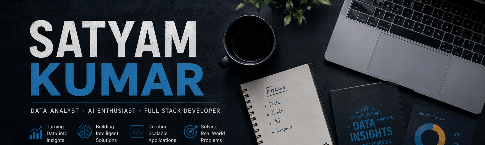

<h1 align="center">Hey, I'm Satyam Kumar 👋</h1>

<p align="center">
  <b>Data Analyst · AI Enthusiast · Full Stack Developer</b><br/>
  Building intelligent systems, analytics dashboards, and scalable applications.
</p>

<p align="center">
  <a href="https://linkedin.com/in/satyam-ku">
    
  </a>

  <a href="https://github.com/satyam-ku">
    
  </a>

  <a href="mailto:rajsatyam2005@gmail.com">
    
  </a>
</p>

---

# 💫 About Me

- 🎓 B.Tech CSE Student at **Lovely Professional University**
- 📊 IBM Certified **Data Analyst**
- 🤖 Passionate about **Artificial Intelligence & Machine Learning**
- 🌐 Interested in **Full Stack Development**
- 📈 Love working with **Data Analytics & Visualization**
- 💻 Strong focus on **DSA & Problem Solving**
- ☁️ Exploring **DevOps & System Design**
- ⚡ Building projects that solve real-world problems

---

# 🚀 What I'm Working On

- 📊 Advanced analytics dashboards using **Power BI**
- 🤖 AI & ML-based prediction systems
- 🏋️ Full-featured **Gym Management Platform**
- 🎬 ML-powered **Movie Revenue Prediction System**
- 📚 Improving DSA skills with consistent LeetCode practice

---

# 💻 Tech Stack

## 🚀 Programming Languages


---

## 🌐 Web Development


---

## 📊 Data Analytics & AI


---

## ⚙️ Tools & Technologies


---

# 📊 GitHub Stats

<p align="center">
  
</p>

<p align="center">
  
  
  
</p>

---

# 🏆 GitHub Trophies

<p align="center">
  
</p>

---

# 🐍 Contribution Snake

<p align="center">
  
</p>

---

# ⚡ Fun Fact

```cpp
while(!success)
{
    keepLearning();
    keepBuilding();
}
```

---

<h3 align="center">✨ "Transforming data into decisions and ideas into reality." ✨</h3>
